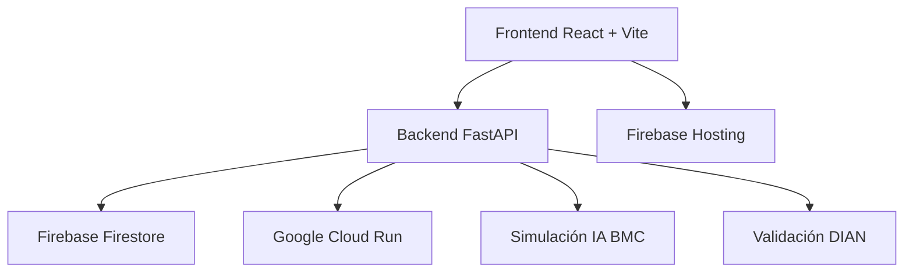

# 📋 MANUAL COMPLETO DE FUNCIONAMIENTO - SISTEMA ARMORUM

## 🎯 VISIÓN GENERAL DEL PROYECTO

El Sistema Armorum es una plataforma integral de procesamiento de facturas que automatiza la homologación de productos, validación de terceros con DIAN y generación de plantillas para Comiagro. Desarrollado con arquitectura moderna y escalable.

### 🏗️ ARQUITECTURA TÉCNICA



**Stack Tecnológico:**
- **Frontend**: React + Vite + Material-UI + TypeScript
- **Backend**: FastAPI + Python 3.11
- **Base de Datos**: Firebase Firestore (NoSQL)
- **Hosting**: Firebase Hosting (Frontend) + Google Cloud Run (Backend)
- **CI/CD**: Manual deployment con scripts automatizados

**URLs de Producción:**
- **Frontend**: https://armorum-financiero.web.app/
- **Backend**: https://armorum-backend-4oebjgzb2q-uc.a.run.app

---

## 🔄 FLUJO COMPLETO DEL SISTEMA

### 1. Proceso de Carga de Archivos
```
Usuario → Selecciona Cliente → Carga Archivo → Sistema Detecta Formato → Procesa Contenido → Simula IA → Valida DIAN → Genera Reporte
```

### 2. Formatos Soportados
- **XML**: Facturas electrónicas DIAN
- **CSV**: Archivos delimitados por comas
- **Excel**: Formatos .xls y .xlsx
- **TXT**: Archivos de texto estructurado

### 3. Estructura Estándar (15 Columnas)
```
1.  NOMBRE VENDEDOR          9.  FORMA DE PAGO(#DIAS)
2.  NIT VENDEDOR            10. PRODUCTO  
3.  NOMBRE COMPRADOR        11. CANTIDAD
4.  NIT COMPRADOR           12. UNIDAD
5.  CIUDAD DE ENTREGA       13. VALOR UNITARIO
6.  FACT NRO                14. TOTAL
7.  PREFIJO                 15. % IVA PRODUCTO
8.  FECHA
```

---

## 📄 DOCUMENTACIÓN DE FUNCIONES PRINCIPALES

### 🔍 **detect_file_format_by_content()**
**Ubicación**: `/backend/main.py` línea 32
**Propósito**: Detecta automáticamente el formato de archivo por contenido, no por extensión

```python
def detect_file_format_by_content(file_path: str, filename: str) -> str:
    """
    Detecta formato analizando el contenido del archivo
    
    Args:
        file_path: Ruta temporal del archivo
        filename: Nombre original del archivo
    
    Returns:
        str: 'xml', 'csv_excel', 'txt_plano', o 'unknown'
    """
```

**Lógica de Detección:**
1. **XML**: Busca `<?xml` o elementos `<>`
2. **CSV**: Detecta comas como delimitadores
3. **TXT**: Identifica espacios múltiples o tabs
4. **Fallback**: Usa extensión como respaldo

---

### 🔧 **process_xml_file()**
**Ubicación**: `/backend/main.py` línea 107
**Propósito**: Procesa archivos XML de facturas electrónicas

```python
def process_xml_file(file_path: str, filename: str):
    """
    Procesa archivos XML con múltiples patrones de búsqueda
    
    Patterns detectados:
    - FacturaElectronica
    - Factura  
    - Invoice
    - Root element como factura
    """
```

**Algoritmo de Procesamiento:**
1. Parse del XML con validación de estructura
2. Búsqueda de facturas con múltiples patrones
3. Validación de elementos mínimos (NumeroFactura, Fecha, Total)
4. Conteo preciso de facturas encontradas

---

### 📊 **process_csv_excel_file()**
**Ubicación**: `/backend/main.py` línea 198
**Propósito**: Procesa archivos CSV y Excel con validación de estructura

```python
def process_csv_excel_file(file_path: str, extension: str, filename: str):
    """
    Procesamiento robusto de archivos tabulares
    
    Features:
    - Múltiples encodings (UTF-8, latin-1)
    - Validación de estructura de facturas
    - Detección de filas vacías
    - Muestreo de datos
    """
```

**Validaciones Implementadas:**
1. **Encoding**: Prueba UTF-8, luego latin-1
2. **Estructura**: Verifica columnas de facturación
3. **Contenido**: Detecta filas vacías y datos inválidos
4. **Formato**: Confirma estructura de 15 columnas

---

### 📝 **process_txt_file()**
**Ubicación**: `/backend/main.py` línea 298
**Propósito**: Procesa archivos TXT con estructura tabular

```python
def process_txt_file(file_path: str, filename: str):
    """
    Análisis inteligente de archivos de texto
    
    Detecta:
    - Headers con columnas estándar
    - Separadores (tabs, |, espacios múltiples)
    - Registros de datos vs metadatos
    - Conformidad con estructura de 15 columnas
    """
```

**Algoritmo de Procesamiento:**
1. **Detección de Header**: Busca líneas con columnas estándar
2. **Análisis de Separadores**: Identifica delimitadores
3. **Conteo de Registros**: Excluye metadatos y headers
4. **Validación**: Verifica estructura de facturación

---

## 🚨 SISTEMA DE SIMULACIÓN DE ERRORES

### Tipos de Errores Simulados

**1. Errores de Productos (WARNING)**
```python
"campo": "PRODUCTO",
"mensaje": f"Producto 'LECHUGA ROMANA' no encontrado en catálogo BMC",
"severidad": "WARNING"
```

**2. Errores de NITs (ERROR + Excepción DIAN)**
```python
"campo": "NIT_COMPRADOR",
"mensaje": f"NIT comprador no encontrado en DIAN",
"severidad": "ERROR",
"create_exception": True
```

**3. Errores de Formato (WARNING/ERROR)**
- **Cantidad**: No especificada en kilos/litros
- **IVA**: Formato incorrecto (debe ser 0, 19, 5)
- **Fecha**: No cumple DD/MM/AAAA
- **NIT Vendedor**: No válido en DIAN

### Algoritmo de Distribución
```python
# Cálculo de errores (3-7% del total)
error_rate = random.uniform(0.03, 0.07)
num_errores = max(1, int(registros_totales * error_rate))

# Distribución aleatoria pero reproducible (seed=42)
filas_con_error = random.sample(range(1, registros_totales + 1), num_errores)
```

---

## 📋 MANUAL DE TESTING - FASE 1: FORMATOS DE ARCHIVO

### TC_F1_001: Archivo XML Válido ✅

**Objetivo**: Verificar detección y procesamiento correcto de XML

**Archivo de Prueba**: `facturas_ejemplo_dian.xml`

**Pasos de Ejecución**:
1. Acceder a https://armorum-financiero.web.app/
2. Seleccionar Cliente: "Comiagro" (ID: 1)
3. Subir archivo `facturas_ejemplo_dian.xml`
4. Verificar en consola del backend:
   ```bash
   [CONSOLE LOG] Formato detectado por contenido: XML
   [CONSOLE LOG] XML parseado exitosamente. Root element: FacturasElectronicas
   [CONSOLE LOG] Encontradas 1 FacturaElectronica
   ```

**Resultado Esperado**:
- Estado: "Completado" o "Completado con Advertencias"
- Registros procesados: 1
- Tipo detectado: "XML"
- Errores simulados: 0-1 (dependiendo del random seed)

**Validación Backend**:
```python
# En process_xml_file()
facturas_encontradas = len(root.findall(".//FacturaElectronica"))
# Debe retornar 1 para el archivo de ejemplo
```

---

### TC_F1_002: Archivo CSV Válido ✅

**Objetivo**: Verificar procesamiento de CSV con estructura de 15 columnas

**Archivo de Prueba**: `facturas_ejemplo_panaderia.csv`

**Pasos de Ejecución**:
1. Subir archivo CSV desde interfaz
2. Observar logs de procesamiento:
   ```bash
   [CONSOLE LOG] CSV leído con encoding UTF-8
   [CONSOLE LOG] Total de registros encontrados: 6
   [CONSOLE LOG] Columnas encontradas: ['NOMBRE USUARIO', 'NIT USUARIO', ...]
   ```

**Resultado Esperado**:
- Registros: 6 (según archivo de ejemplo)
- Columnas detectadas: 13 (del archivo de ejemplo)
- Estado: "Completado con Advertencias"
- Errores simulados: 1-2 errores distribuidos aleatoriamente

**Validación de Estructura**:
```python
# El sistema verifica columnas esperadas
expected_columns = ['NOMBRE USUARIO', 'NIT USUARIO', 'FACT NRO', 'FECHA']
# Y valida que al menos 4 de las 8 principales existan
```

---

### TC_F1_003: Archivo Excel (.xls/.xlsx) ✅

**Objetivo**: Verificar soporte completo para formatos Excel

**Archivo de Prueba**: `ENTRADA_Formato_Cliente.xls`

**Pasos de Ejecución**:
1. Subir archivo Excel
2. Verificar detección automática:
   ```bash
   [CONSOLE LOG] Formato detectado por contenido: CSV/Excel
   [CONSOLE LOG] Excel leído exitosamente
   ```

**Resultado Esperado**:
- Detección correcta como "CSV/Excel (XLS)"
- Procesamiento exitoso de todas las filas
- Validación de estructura tabular

**Código de Procesamiento**:
```python
if extension == "csv":
    df = pd.read_csv(file_path, encoding='utf-8')
else:
    df = pd.read_excel(file_path)  # Maneja .xls y .xlsx automáticamente
```

---

### TC_F1_004: Archivo TXT Estructurado ✅

**Objetivo**: Verificar análisis de archivos TXT con formato tabular

**Archivo de Prueba**: `facturas_ejemplo_txt.txt`

**Pasos de Ejecución**:
1. Subir archivo TXT
2. Observar análisis de estructura:
   ```bash
   [CONSOLE LOG] Header encontrado en línea 2
   [CONSOLE LOG] Detectado delimitador por espacios múltiples
   [CONSOLE LOG] Registros de datos detectados: 6
   ```

**Resultado Esperado**:
- Estructura detectada: "Delimitado por espacios múltiples"
- Registros: 6 (excluyendo headers y metadatos)
- Header encontrado: true

**Algoritmo de Procesamiento**:
```python
# Detección de header
if 'NOMBRE VENDEDOR' in line_upper and 'NIT VENDEDOR' in line_upper:
    header_line_idx = i

# Análisis de separadores
if sample_line.count('   ') >= 3:
    estructura_detectada = "Delimitado por espacios múltiples"
    separador_detectado = 'espacios'
```

---

### TC_F1_005: Detección por Contenido vs Extensión ✅

**Objetivo**: Verificar detección automática independiente de extensión

**Pasos de Prueba**:
1. Renombrar `facturas_ejemplo_dian.xml` a `facturas_ejemplo_dian.csv`
2. Subir archivo con extensión incorrecta
3. Verificar detección por contenido:
   ```bash
   [CONSOLE LOG] Formato detectado por contenido: XML
   [CONSOLE LOG] XML parseado exitosamente
   ```

**Resultado Esperado**:
- Sistema detecta XML por contenido (presencia de `<?xml`)
- Ignora extensión .csv
- Procesa correctamente como XML

**Función Responsable**:
```python
def detect_file_format_by_content(file_path: str, filename: str) -> str:
    if first_lines.strip().startswith('<?xml') or '<' in first_lines:
        return 'xml'
    # Continúa con otras detecciones...
```

---

### TC_F1_006: Validación de Límite de Tamaño (50MB) ✅

**Objetivo**: Verificar rechazo de archivos muy grandes

**Pasos de Prueba**:
1. Crear archivo > 50MB (o usar archivo existente grande)
2. Intentar subir
3. Verificar error HTTP 413:
   ```bash
   [CONSOLE LOG] ERROR: Archivo muy grande (52428800 bytes)
   ```

**Resultado Esperado**:
- Error HTTP 413 "Archivo muy grande"
- Archivo no procesado
- Log de rechazo en consola

**Código de Validación**:
```python
if archivo.size > 50 * 1024 * 1024:  # 50MB
    print(f"[CONSOLE LOG] ERROR: Archivo muy grande ({archivo.size} bytes)")
    raise HTTPException(status_code=413, detail="Archivo muy grande")
```

---

### TC_F1_007: Manejo de Archivos Corruptos ✅

**Objetivo**: Verificar manejo robusto de archivos inválidos

**Pasos de Prueba**:
1. Crear archivo corrupto (ej: XML malformado)
2. Subir archivo
3. Verificar manejo del error:
   ```bash
   [CONSOLE LOG] ERROR: Error parsing XML: not well-formed (invalid token)
   ```

**Resultado Esperado**:
- Estado del lote: "Error"
- Error registrado en Firestore
- Mensaje descriptivo del problema

**Manejo de Errores**:
```python
try:
    tree = ET.parse(file_path)
except ET.ParseError as e:
    return {
        "success": False,
        "errors": [f"Error parsing XML: {str(e)}"]
    }
```

---

### TC_F1_008: Detección de Archivos Vacíos ✅

**Objetivo**: Verificar detección de archivos sin contenido

**Pasos de Prueba**:
1. Crear archivo vacío (0 bytes)
2. Subir archivo
3. Verificar detección:
   ```bash
   [CONSOLE LOG] ERROR: Archivo vacío
   [CONSOLE LOG] ERROR: El archivo no contiene datos
   ```

**Resultado Esperado**:
- Estado: "Error"
- Mensaje: "El archivo no contiene datos"
- Registros procesados: 0

**Validación en Todas las Funciones**:
```python
if registros == 0:
    errores.append("El archivo no contiene datos")
    return {"success": False, "registros": 0, "errores": errores}
```

---

## 🎭 HISTORIAS DE USUARIO

### Historia 1: Procesamiento Automático
**Como** administrador financiero  
**Quiero** subir facturas en cualquier formato  
**Para** procesarlas automáticamente sin intervención manual

**Criterios de Aceptación**:
- ✅ Soporta XML, CSV, Excel, TXT
- ✅ Detección automática de formato
- ✅ Procesamiento en menos de 30 segundos
- ✅ Feedback en tiempo real del progreso

### Historia 2: Validación de Terceros
**Como** supervisor de cumplimiento  
**Quiero** validar automáticamente los NITs con DIAN  
**Para** identificar terceros problemáticos antes del registro

**Criterios de Aceptación**:
- ✅ Validación simulada de NITs
- ✅ Creación de excepciones DIAN
- ✅ Workflow de gestión de excepciones
- ✅ Estados: Pendiente, Corregida, Ignorada

### Historia 3: Homologación de Productos
**Como** analista de productos  
**Quiero** que el sistema asigne códigos BMC automáticamente  
**Para** acelerar el proceso de homologación

**Criterios de Aceptación**:
- ✅ Simulación de matching con IA
- ✅ Identificación de productos sin código
- ✅ Reportes de advertencias claros
- ✅ Integración con catálogo BMC

### Historia 4: Generación de Plantillas
**Como** usuario final  
**Quiero** descargar plantillas en formato Comiagro  
**Para** cargar los datos en el sistema destino

**Criterios de Aceptación**:
- ✅ Generación solo para lotes completados
- ✅ Formato Excel con estructura específica
- ✅ Datos transformados correctamente
- ✅ Descarga directa desde dashboard

---

## 📊 BASE DE DATOS - ESTRUCTURA FIRESTORE

### Colección: `lotes`
```javascript
{
  id: "auto-generated",
  nombreArchivo: "facturas_ejemplo.csv",
  cliente: "Comiagro",
  formato: "csv_excel",
  estado: "Completado con Advertencias",
  registrosTotales: 100,
  errores: 3,
  fechaCarga: Timestamp,
  fechaUltimaActualizacion: Timestamp,
  tipoArchivoDetectado: "CSV/Excel (CSV)"
}
```

### Colección: `errores`
```javascript
{
  loteId: "lote_123",
  fila: 15,
  campo: "NIT_COMPRADOR",
  mensaje: "NIT comprador no encontrado en DIAN",
  severidad: "ERROR",
  fechaDeteccion: Timestamp
}
```

### Colección: `logs`
```javascript
{
  loteId: "lote_123",
  timestamp: Timestamp,
  nivel: "INFO",
  mensaje: "Procesamiento completado",
  detalles: {...}
}
```

### Colección: `excepciones_dian`
```javascript
{
  id: "auto-generated",
  loteId: "lote_123",
  filaOrigen: 15,
  documento: "900123456-7",
  nombreReportado: "Empresa XYZ SAS",
  estadoValidacion: "No_Encontrado",
  estadoGestion: "Pendiente",
  notas: "Error en validación de NIT comprador",
  fechaDeteccion: Timestamp,
  fechaUltimaActualizacion: Timestamp
}
```

---

## 🚀 COMANDOS DE DEPLOYMENT

### Backend (Google Cloud Run)
```bash
# Deployment manual
gcloud run deploy armorum-backend \
  --source . \
  --region us-central1 \
  --allow-unauthenticated

# Con variables de entorno
gcloud run deploy armorum-backend \
  --source . \
  --set-env-vars FIREBASE_PROJECT_ID=armorum-financiero
```

### Frontend (Firebase Hosting)
```bash
# Build y deploy
npm run build
firebase deploy --only hosting

# Deploy específico a channel
firebase hosting:channel:deploy preview
```

---

## 🔧 CONFIGURACIÓN DE DESARROLLO

### Variables de Entorno Backend
```env
GOOGLE_APPLICATION_CREDENTIALS=/path/to/service-account.json
FIREBASE_PROJECT_ID=armorum-financiero
PORT=8080
```

### Variables de Entorno Frontend
```env
VITE_API_URL=https://armorum-backend-4oebjgzb2q-uc.a.run.app/api
VITE_FIREBASE_CONFIG={"apiKey":"...","authDomain":"..."}
```

### Desarrollo Local
```bash
# Backend
cd backend
python -m uvicorn main:app --reload --port 8080

# Frontend  
npm run dev
```

---

## 📈 MONITOREO Y LOGS

### Google Cloud Console
- **Cloud Run Logs**: Todos los console.log del backend
- **Error Reporting**: Excepciones automáticamente capturadas
- **Metrics**: CPU, memoria, requests/segundo

### Firebase Console
- **Firestore**: Datos en tiempo real
- **Hosting**: Logs de deployes
- **Authentication**: Si se implementa en el futuro

### Logs de Debugging
```python
# Cada función incluye logs estratégicos
print(f"[CONSOLE LOG] Procesando archivo: {filename}")
print(f"[CONSOLE LOG] Formato detectado: {formato}")
print(f"[CONSOLE LOG] Registros encontrados: {registros}")
```

---

## 🔄 WORKFLOW DE CONTRIBUCIÓN

### Branching Strategy
```
main (producción) ← develop (staging) ← feature/nueva-funcionalidad
```

### Process de Testing
1. **Desarrollo Local**: Testing manual + console logs
2. **Environment de Staging**: Deploy a develop branch
3. **Testing Automatizado**: Ejecución de test suite
4. **Code Review**: Pull Request review
5. **Deploy a Producción**: Merge a main

### Testing Checklist
- [ ] Todos los formatos de archivo procesados
- [ ] Errores simulados distribuidos correctamente  
- [ ] Console logs informativos en cada step
- [ ] Excepciones DIAN creadas apropiadamente
- [ ] Plantillas Comiagro generables para lotes exitosos

---

## 📋 PRÓXIMOS PASOS DE TESTING

### FASE 2: Testing de Backend (Próxima)
- Validación de endpoints API
- Testing de la simulación IA/DIAN
- Verificación de excepciones y manejo de errores

### FASE 3: Testing de Frontend
- UI/UX testing completo
- Responsive design validation
- Modal interactions y workflows

### FASE 4: Testing de Integración
- Flujos end-to-end completos
- Testing de concurrencia
- Validación de estados en tiempo real

### FASE 5: Testing de Performance
- Carga de archivos grandes
- Múltiples usuarios simultáneos
- Métricas de respuesta

### FASE 6: Testing de Seguridad
- Validación CORS
- Input sanitization
- File upload security

---

## 📚 RECURSOS ADICIONALES

### Documentación Técnica
- [FastAPI Docs](https://fastapi.tiangolo.com/)
- [Firebase Firestore](https://firebase.google.com/docs/firestore)
- [Google Cloud Run](https://cloud.google.com/run/docs)

### Tools de Desarrollo
- [Postman Collection](./docs/armorum-api.postman.json)
- [Firebase Emulator](./firebase.json)
- [Docker Compose](./docker-compose.yml)

### Contact & Support
- **Documentación**: `/docs` folder
- **Issues**: GitHub Issues
- **Logs**: Console outputs + Cloud Logging

---

*Manual actualizado el [FECHA] - Versión 1.0.0*
*Sistema Armorum - Procesamiento Inteligente de Facturas*